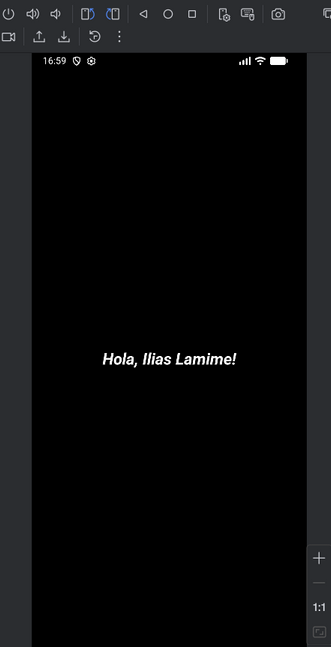
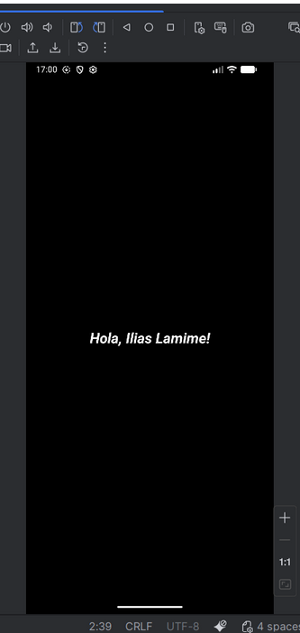
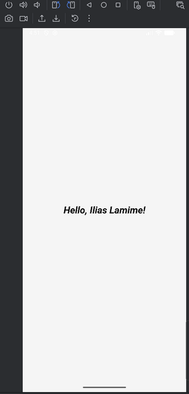
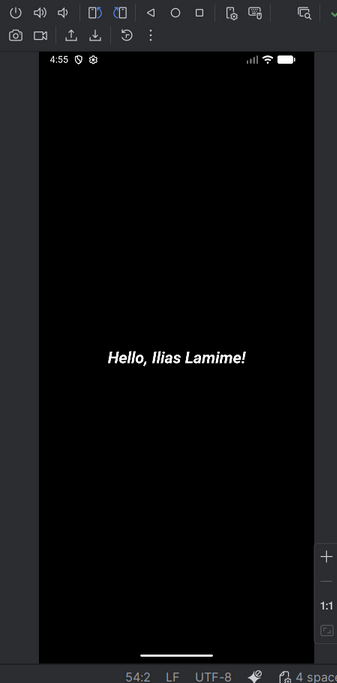

# Hola Nom – Android (Jetpack Compose)

Projecte d'Android fet amb **Kotlin** i **Jetpack Compose**.

Funcionalitats principals:
- Salutació amb el meu nom i cognoms
- Tema personalitzat amb **mode clar i mode fosc**
- **Tipografia pròpia**
- **Multillengua**: català, castellà i anglès (segons idioma del dispositiu)

## Tecnologies

- Android Studio
- Kotlin
- Jetpack Compose (Material 3)
- Min SDK: 28
- Package: `cat.dam.ilias.holailias`

## Multillengua

Els textos es gestionen amb `strings.xml`:

- `values/strings.xml` – Català
- `values-es/strings.xml` – Castellà
- `values-en/strings.xml` – Anglès

La salutació es mostra amb `stringResource(R.string.hello_name)` dins de la UI de Jetpack Compose.

## Temes i tipografia

Els colors de mode clar i mode fosc es defineixen a:

- `ui/theme/Color.kt`
- `ui/theme/Theme.kt`

La tipografia personalitzada es defineix a:

- `res/font/italic.ttf`
- `ui/theme/Type.kt` (FontFamily + Typography)

## Captures de pantalla

### Català
Mode fosc  

### Castellà
Mode fosc  

### Anglès
Mode clar  

Mode fosc  

